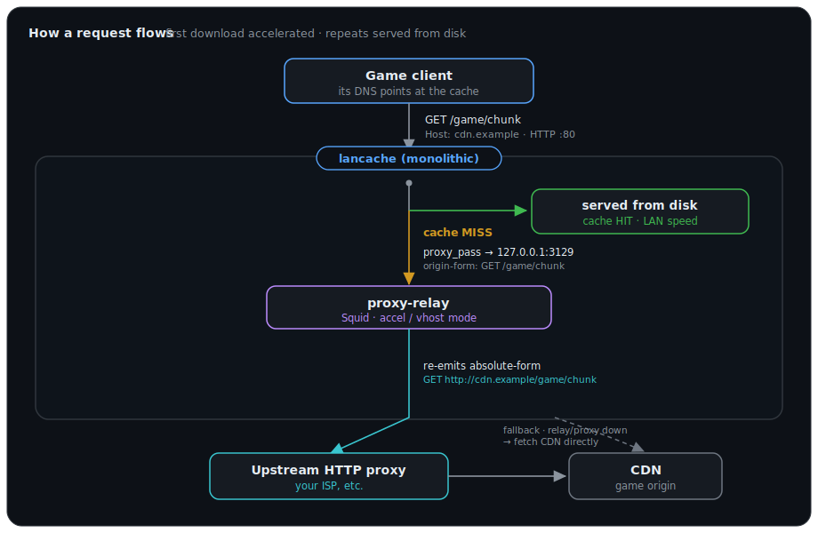

# lancache-http-proxy

Route [lancache](https://lancache.net) **cache-MISS (first-time) downloads through an upstream HTTP forward proxy** — for example your ISP's caching/peering proxy — so first downloads land at full line speed even when the direct path to a game CDN is slow.

Repeat downloads already come off your lancache disk at LAN speed. This project fixes the *other* half: making the **first** download fast too, by sending lancache's upstream fetches through a better-peered proxy. It is a small, self-contained add-on to a standard lancache deployment.

---

## Why

On many connections the bottleneck for game downloads isn't your line — it's **international peering/transit to the CDN**. The line can be multi-gigabit locally yet collapse to a few hundred Mbps to an off-shore CDN.

If your ISP runs a caching proxy (common in many countries), that proxy usually sits on far better-peered transit. Pulling through it can be dramatically faster — even when the proxy itself has to fetch fresh (a proxy-side cache *miss*), purely because of the better path. And when the ISP proxy *does* have the content cached, it's faster still.

Measured example from one real deployment (single stream, large real game-CDN files):

| | Direct | Via ISP proxy | Speedup |
|---|---|---|---|
| 184 MB game file | 397 Mbps | 2,085 Mbps | 5.3× |
| 131 MB game file | 506 Mbps | 1,874 Mbps | 3.7× |
| 123 MB game file | 566 Mbps | 2,341 Mbps | 4.1× |

The proxy reported a **cache MISS** on all three — so that ~4× gain was pure peering, not the proxy serving cached copies.

---

## How it works

<p align="center">
  
</p>

### The core problem this solves

You might expect to just point lancache at a proxy with an environment variable. You can't:

- **lancache has no upstream-proxy option.** (The `UPSTREAM_PROXY` env var some guides mention does not exist in lancachenet/monolithic — its internal "upstream proxy" is an nginx block for handling CDN 302 redirects, unrelated to forward proxies.)
- **nginx ignores `http_proxy`/`https_proxy`** environment variables entirely.
- **nginx's `proxy_pass` can only send *origin-form* requests** (`GET /path`), but a forward proxy requires **absolute-form** (`GET http://host/path`). Point nginx straight at a proxy and you get `400 Bad Request / ERR_INVALID_URL`.

### The fix

Insert a tiny **Squid relay** between lancache and the proxy:

- Squid runs in **accelerator (`accel vhost`) mode**, which *accepts* the origin-form requests nginx sends (using the `Host` header to reconstruct the URL).
- A Squid **`cache_peer ... parent`** then *re-emits* those requests in absolute-form to your upstream proxy.

Two small config files do the rest:

| File | What it does |
|---|---|
| [`conf/squid.conf.template`](conf/squid.conf.template) | The relay: accel/vhost in, `cache_peer` parent out. **You don't edit this** — your proxy is filled in from `.env` at startup. |
| [`conf/30_primary_proxy.conf`](conf/30_primary_proxy.conf) | Overrides lancache's upstream block to `proxy_pass` to the relay, **with automatic direct fallback** if the relay/proxy is down. |
| [`conf/healthcheck.sh`](conf/healthcheck.sh) | Marks the relay container UNHEALTHY if the upstream proxy stops serving. |

No custom image is built and lancache itself is unmodified — the override is a read-only bind-mount.

> **Where do I put my proxy?** Just `UPSTREAM_PROXY_HOST` / `UPSTREAM_PROXY_PORT` in `.env`. That's the only place. It gets substituted into the relay config automatically — you never edit a config file.

---

## Prerequisites

- A Docker host with **Docker Compose v2**.
- Ports **80, 443, and 53** free on the host (lancache's standard requirement). If they're taken (e.g. a NAS web UI), give lancache a dedicated IP via a macvlan network — see [Advanced: dedicated IP](#advanced-dedicated-ip-macvlan).
- An **upstream HTTP forward proxy** you can reach. Check it first:
  ```bash
  # HTTP through the proxy should return real headers (not a 4xx from the proxy):
  curl -x http://YOUR_PROXY:PORT -sI http://steamcdn-a.akamaihd.net/client/installer/steamcmd_linux.tar.gz | head
  ```
  Many ISP proxies are open only to that ISP's subscribers — test from a host on that connection.

---

## Quick start

```bash
git clone https://github.com/sioakim/lancache-http-proxy.git
cd lancache-http-proxy

# 1. Configure everything in one file (including your proxy)
cp .env.example .env
$EDITOR .env
#   UPSTREAM_PROXY_HOST / UPSTREAM_PROXY_PORT  <- your forward proxy (required)
#   LANCACHE_IP, CACHE_ROOT, CACHE_DISK_SIZE, UPSTREAM_DNS

# 2. Launch
docker compose up -d
```

Then point a client's **DNS** at `LANCACHE_IP` (per-device, or network-wide via your router/DHCP) and start a game download.

---

## Verify it's working

**1 — A MISS goes through your proxy.** From a host whose DNS is the cache:

```bash
curl -sI -H "Host: steamcdn-a.akamaihd.net" \
  http://LANCACHE_IP/client/installer/steamcmd_linux.tar.gz | grep -i via
# Via: 1.1 your-isp-proxy (squid), 1.1 <relay> (squid/6.x)
```

A `Via:` header naming your proxy means the request traversed it.

**2 — The relay log confirms the parent was used:**

```bash
docker exec lancache-proxy-relay tail -3 /var/log/squid/access.log
# ... TCP_MISS/200 ... GET http://steamcdn-a.akamaihd.net/... FIRSTUP_PARENT/<proxy-ip> ...
#                          ^ absolute-form              ^ forwarded to your parent proxy
```

**3 — The relay is healthy:**

```bash
docker inspect --format '{{.State.Health.Status}}' lancache-proxy-relay   # healthy
```

**4 — Compare speeds (optional A/B).** Fetch a large real CDN object direct vs through your proxy and compare `speed_download`:

```bash
U=http://steamcdn-a.akamaihd.net/client/installer/steamcmd_linux.tar.gz
curl -s -o /dev/null -w 'direct: %{speed_download} B/s\n' "$U"
curl -s -o /dev/null -x http://YOUR_PROXY:PORT -w 'proxy : %{speed_download} B/s\n' "$U"
```

---

## Resilience & fallback

The proxy is **not** a hard dependency:

- If the relay container is down, nginx gets a connection error → **falls back to fetching the CDN directly** (`error_page 502 503 504`).
- If the relay is up but your proxy is dead, Squid (`never_direct`) returns a 5xx → nginx **falls back to direct** the same way.
- Either way, downloads keep working — just at normal direct speed — and the relay container reports **UNHEALTHY** so you notice.

Cache HITs (served from disk) never touch the upstream path at all.

---

## Configuration reference

### Your upstream proxy — `.env`

Set it in `.env` (the only place):

```ini
UPSTREAM_PROXY_HOST=proxy.example-isp.net
UPSTREAM_PROXY_PORT=8080
```

These are substituted into the relay's `cache_peer` line at container start
(see [`conf/squid.conf.template`](conf/squid.conf.template)). After changing
them, run `docker compose up -d` to apply.

### Scope to specific CDNs only (optional)

By default **all** cache-MISS HTTP fetches go through your proxy (this is usually what you want — the peering benefit is general). To send only some CDNs through it and the rest direct, gate the relay `proxy_pass` on `$host` in `conf/30_primary_proxy.conf`, e.g.:

```nginx
  location / {
    set $up "http://127.0.0.1:3129$request_uri";          # default: via relay
    if ($host !~* (steamcontent\.com|blizzard\.com)$) {
      set $up "http://$host$request_uri";                 # these go direct
    }
    proxy_pass $up;
    proxy_set_header Host $host;
    proxy_intercept_errors on;
    error_page 301 302 307 = @upstream_redirect;
    error_page 502 503 504 = @direct_fallback;
  }
```

### Healthcheck target

`conf/healthcheck.sh` probes a stable Steam CDN object by default. Override via env on the `proxy-relay` service if needed: `HEALTHCHECK_HOST`, `HEALTHCHECK_PATH`, `RELAY_PORT`.

### Advanced: dedicated IP (macvlan)

If the host already uses 80/443/53 (e.g. a NAS), put the stack on its own LAN IP with a macvlan network instead of publishing ports. Add a network and replace the `ports:` on `lancache` with an `ipv4_address`:

```yaml
networks:
  lan:
    driver: macvlan
    driver_opts: { parent: eth0 }     # your LAN interface / bridge
    ipam:
      config:
        - subnet: 192.168.1.0/24
          gateway: 192.168.1.1

services:
  lancache:
    networks:
      lan:
        ipv4_address: 192.168.1.10    # outside your DHCP pool
    # remove the "ports:" block
```

Set `LANCACHE_IP` to that address. Note: a host can't reach its own macvlan containers — test from another LAN machine.

---

## Disable / uninstall

Remove the proxy routing, keep the cache:

```bash
# delete the proxy-relay service and the 30_primary_proxy.conf mount, then:
docker compose up -d
```

lancache reverts to fetching CDNs directly. Or `docker compose down` to stop everything.

---

## Troubleshooting

| Symptom | Cause / fix |
|---|---|
| `400 ERR_INVALID_URL` from your proxy | You pointed nginx straight at the proxy. That's the whole reason the relay exists — it must sit in between. Don't bypass it. |
| Relay container UNHEALTHY | Your upstream proxy isn't reachable/serving. Test `curl -x http://YOUR_PROXY:PORT -sI http://steamcdn-a.akamaihd.net/...`. Downloads still work (direct fallback). |
| No `Via:` from your proxy on a MISS | The object was a lancache HIT (already cached) — try a fresh path. Or the relay fell back to direct (proxy down). |
| `port is already allocated` (53/80/443) | Something else owns the port. Free it or use the [macvlan](#advanced-dedicated-ip-macvlan) approach. |
| Relay logs `Detected DEAD Parent` then `REVIVED` at startup | Normal — Squid's initial probe; it revives once it reaches the parent. |
| Proxy is slower than direct | Your ISP proxy may be poorly provisioned, or your direct path is already fine. Run the A/B above; if it doesn't help, disable it. |

---

## Notes & caveats

- This routes plain-HTTP game-CDN traffic, which is what lancache caches. HTTPS that lancache only SNI-passes-through is unaffected.
- Pushing all your game-download traffic through an ISP proxy is fine for personal use; be mindful of the proxy operator's acceptable-use terms.
- Built on the official [lancachenet](https://github.com/lancachenet) images and [Ubuntu Squid](https://hub.docker.com/r/ubuntu/squid). Not affiliated with either project.

## License

[MIT](LICENSE)
